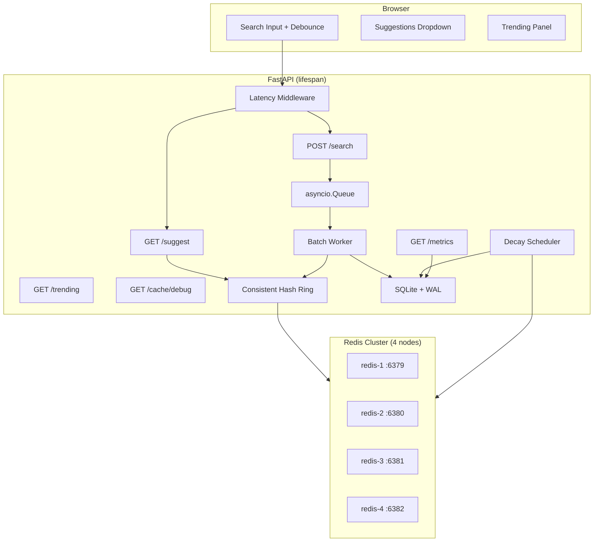

# Architecture

## System Diagram



## Why Not a Trie?

A **prefix trie** (or compressed trie / DAFSA) is the classic in-memory structure for autocomplete: O(prefix length) lookup, natural top-K by stored counts at nodes.

We **rejected a trie** for this implementation because:

1. **Persistence and scale** — Our source of truth is SQLite with 200K+ rows. Keeping a full trie in memory duplicates the dataset and complicates recovery after restarts.
2. **Distributed cache** — The course design shards **per-prefix keys** across Redis nodes via consistent hashing. A trie would live on one process; replicating or partitioning a mutable trie across nodes adds coordination overhead that prefix-key caching avoids.
3. **Write amplification** — Each search updates counts. With a trie, many nodes along the path may need updates. Batched SQLite `UPSERT` + Redis re-warming is simpler and matches the taught flow.
4. **MVP fit** — `LIKE 'prefix%'` with a collation index on `query` is sufficient at demo scale; the 3-character gate bounds scan cost.

**Trade-off:** We avoid a hot in-memory trie by serving reads from a pre-warmed Redis cache. SQLite holds query/count data and feeds cache warming at startup, after batch flushes, and after decay — not request-time fallback for `/suggest`.

## Consistent Hashing

Four independent Redis instances act as a **distributed cache**, not Redis Cluster. A **consistent hash ring** (MD5, 150 virtual nodes per physical node) maps each prefix string to exactly one node.

**Why consistent hashing?**

| Benefit | Explanation |
|---------|-------------|
| Stable routing | Same prefix always maps to the same node → high hit rate |
| Minimal remapping | Adding/removing a node only moves ~1/N of keys |
| No single hot spot | Virtual nodes spread prefixes evenly across machines |
| Simple client logic | Application picks the node; no central proxy required |

**Flow:** `get_node("iph")` → `redis-2` → `GET suggest:iph`. Invalidation deletes `suggest:i`, `suggest:ip`, `suggest:iph`, … on their respective nodes.

## Three-Character Prefix Gate

Suggestions return `[]` until the user types **≥ 3 characters** (`MIN_PREFIX_LENGTH`):

- `src/database.py` — skips SQL for short prefixes during cache warming
- `GET /suggest` — enforces gate before Redis lookup
- `src/static/app.js` — no API call until length ≥ 3

Short prefixes match too many rows (e.g. `"a"` → huge scan). The gate matches instructor guidance and keeps SQLite warming queries bounded.

## Request Flows

### Suggest (`GET /suggest?q=iph`)

1. Reject if `len(q.lstrip()) < 3`
2. `consistent_hash.get_node(prefix)` → Redis node
3. Cache hit → return JSON suggestions
4. Cache miss → return `[]` (no SQLite read on the request path)

SQLite is **not** queried during suggest. The cache is populated separately (see below).

### Cache warming (SQLite → Redis)

| Trigger | Action |
|---------|--------|
| **App startup** | `warm_all_from_db()` — load all queries from SQLite, warm every prefix ≥ 3 chars |
| **Batch flush** | `warm_prefixes_for_queries()` — re-warm prefixes for updated queries |
| **Decay cycle** | `flush_all_suggestion_cache()` then `warm_all_from_db()` |

Warming reads SQLite via `get_suggestions_by_prefix` and stores results in Redis with TTL 300s.

### Search (`POST /search`)

1. Validate non-empty query; return `{"message": "Searched"}` immediately
2. Push `(query, 1)` onto global `asyncio.Queue`; increment search-event metric
3. Batch worker aggregates into `{query: accumulated_count}`
4. Flush when buffer ≥ 100 queries **or** 10s timer elapses
5. `increment_counts` (single DB write per flush) + re-warm affected prefix keys in Redis

**Write reduction:** 50 identical searches → 1 buffer entry → 1 DB flush. Metrics expose `write_reduction_ratio = search_events / db_writes`.

### Nightly Decay

Every 24 hours the decay scheduler runs:

```sql
UPDATE queries SET count = CAST(count * 0.9 AS INTEGER) WHERE count > 0;
```

Then flushes all suggestion cache keys and re-warms from SQLite so rankings reflect decayed counts. This is a **scheduled night script**, not per-write exponential moving average — simpler and aligned with the lecture.

## SQLite Schema

```sql
PRAGMA journal_mode=WAL;

CREATE TABLE queries (
    id INTEGER PRIMARY KEY AUTOINCREMENT,
    query TEXT UNIQUE NOT NULL COLLATE NOCASE,
    count INTEGER NOT NULL DEFAULT 0,
    created_at TIMESTAMP DEFAULT CURRENT_TIMESTAMP
);

CREATE INDEX idx_queries_prefix ON queries(query COLLATE NOCASE);
```

`COLLATE NOCASE` prevents case-sensitive duplicate queries. LIKE patterns escape `%` and `_` for literal prefix matching.

## Observability (`GET /metrics`)

| Metric | Source |
|--------|--------|
| `latency_ms.p95` | Rolling window (1000 samples) from HTTP middleware |
| `cache.hit_rate` | `hits / (hits + misses)` from `CacheManager` |
| `database.reads` / `writes` | Counters in `database.py` |
| `batch.search_events` | Incremented on each `POST /search` |
| `batch.write_reduction_ratio` | `search_events / db_writes` |

## Background Tasks (Lifespan)

| Task | Role |
|------|------|
| Batch worker | Consume search queue, flush to SQLite, re-warm cache |
| Decay scheduler | Daily count decay + full cache flush and re-warm |

On shutdown: cancel tasks, flush remaining batch buffer, close Redis clients.

## Dataset Strategy

See [README.md](README.md#dataset). Default dev workflow uses 200K synthetic queries; AmazonQAC is recommended when exporting real autocomplete training data.
