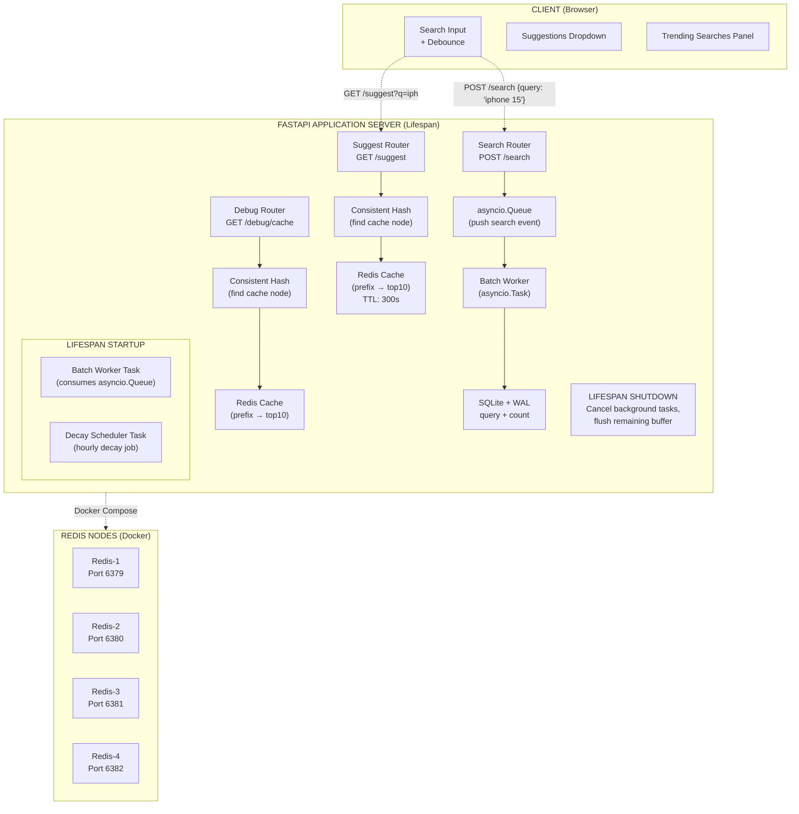

## ARCHITECTURE



### Key Data Flow Changes

#### 1. Search Submission (`POST /search`)

```
1. User presses Enter → POST /search {"query": "iphone 15"}
2. FastAPI returns {"message": "Searched"} immediately
3. Search Router pushes ("iphone 15", 1) to global asyncio.Queue
4. Batch Worker Task (running continuously):
   a. Pulls from queue, aggregates in local dict buffer
   b. On timer (10s) or size limit (100):
      - Flush: UPDATE queries SET count = count + ? WHERE query = ?
      - For each updated query: DELETE cache keys for all its prefixes
      - (Lazy invalidation — no eager rebuild)
```

#### 2. Suggestion Request (`GET /suggest?q=iph`)

```
1. User types "iph" → frontend debounces (300ms)
2. If len(prefix) < 3: return empty list
3. consistent_hash_ring.get_node("iph") → Redis Node X
4. redis[X].get("suggest:iph")
   ├── HIT → return cached suggestions
   └── MISS → 
      ├── Acquire asyncio.Lock for prefix "iph" (thundering herd protection)
      ├── Query SQLite: SELECT query, count FROM queries 
      │                WHERE query LIKE 'iph%' ORDER BY count DESC LIMIT 10
      ├── Store result in Redis Node X with TTL=300s
      ├── Release lock
      └── Return suggestions
```

#### 3. Cache Invalidation on Batch Flush

```
On flush, for each updated query (e.g., "iphone 15"):
  prefixes = ["i", "ip", "iph", "ipho", "iphon", "iphone", "iphone ", "iphone 1", "iphone 15"]
  for prefix in prefixes:
      node = consistent_hash_ring.get_node(prefix)
      redis[node].delete(f"suggest:{prefix}")
      
  # Cache is NOT rebuilt here. Next request triggers lazy rebuild.
```

#### 4. Decay Job (Hourly)

```
Scheduled task runs every hour:
  UPDATE queries SET count = CAST(count * 0.9 AS INTEGER) WHERE count > 0
  
After decay: invalidate ALL cache keys (or let TTL expire naturally)
```

### SQLite Schema

```sql
PRAGMA journal_mode=WAL;

CREATE TABLE queries (
    id INTEGER PRIMARY KEY AUTOINCREMENT,
    query TEXT UNIQUE NOT NULL,
    count INTEGER NOT NULL DEFAULT 0,
    created_at TIMESTAMP DEFAULT CURRENT_TIMESTAMP
);

-- Index for fast prefix search
CREATE INDEX idx_queries_prefix ON queries(query COLLATE NOCASE);
```

### Why No `last_updated_at`?

The scheduled decay approach doesn't need per-row timestamps. The decay job is a simple `UPDATE` with a scalar multiplication. If we were doing write-time EMA (rejected), we'd need `last_updated_at` to compute time deltas.

---
