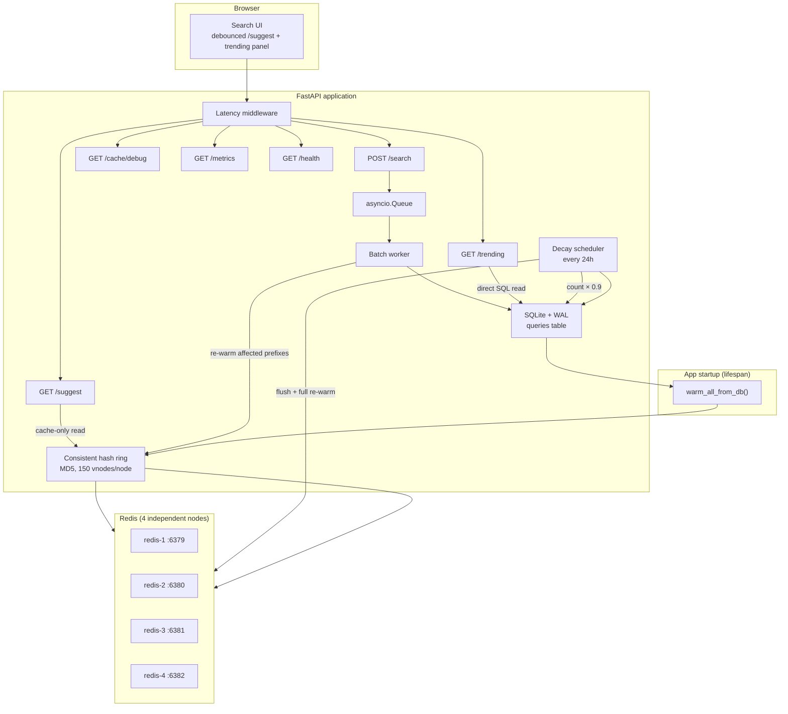

# Typeahead System — Project Report

Distributed autocomplete service built with **FastAPI**, **Redis** (four sharded nodes), and **SQLite**. This report documents the implemented architecture, data pipeline, API surface, design tradeoffs, and how to measure performance.

---

## 1. Architecture

### System diagram



### How the pieces fit together

**Read path (`GET /suggest`)** — The suggest endpoint reads **Redis only**. A consistent hash ring maps each prefix string to one of four Redis nodes. Keys use the form `suggest:{prefix}` with a 300-second TTL. On a cache hit, the stored JSON list of `{query, count}` pairs is returned (top 10 by count). On a cache miss, the endpoint returns an empty list — **SQLite is not queried at request time**.

**Write path (`POST /search`)** — Search events are accepted immediately and enqueued as `(query, 1)` tuples. A background batch worker aggregates counts in memory and flushes to SQLite when the buffer reaches 100 distinct queries or 10 seconds elapse, whichever comes first. After each flush, affected prefix keys are re-warmed in Redis from SQLite.

**Trending (`GET /trending`)** — Reads SQLite directly, returning the top global queries ordered by `count` descending. This path bypasses Redis because trending is a low-frequency, whole-table ranking query.

**Cache warming (SQLite → Redis)** — SQLite holds the durable source of truth (`query`, `count`). Redis is populated from SQLite at:

| Trigger | Action |
|---------|--------|
| **App startup** | `warm_all_from_db()` — load every stored query and warm all prefixes ≥ `MIN_PREFIX_LENGTH` |
| **Batch flush** | `warm_prefixes_for_queries()` — re-warm prefixes for queries that were updated |
| **Decay cycle** | `flush_all_suggestion_cache()` then `warm_all_from_db()` |

**Background tasks** — Started in the FastAPI lifespan context manager:

- **Batch worker** — consumes the search queue, flushes aggregated counts, re-warms cache.
- **Decay scheduler** — every 24 hours applies `count = CAST(count * 0.9 AS INTEGER)` to all positive counts, then flushes and fully re-warms the suggestion cache.

On shutdown, background tasks are cancelled, any remaining batch buffer is flushed, and Redis clients are closed.

### Prefix gate

The built implementation uses `MIN_PREFIX_LENGTH = 1` (configured in `src/config.py`). Empty or whitespace-only prefixes return `[]` without touching Redis. The frontend (`src/static/app.js`) uses the same threshold before calling `/suggest`.

> **Note:** Course materials and `architecture.md` describe a 3-character minimum to limit expensive prefix scans. This implementation allows single-character prefixes once the cache is warm. Raising `MIN_PREFIX_LENGTH` to 3 in `src/config.py` (and the frontend constant) would align with that teaching pattern and reduce warming volume for very short prefixes.

---

## 2. Dataset Source and Loading

### What data this project uses

This is **not** a live import of an external dataset at runtime. Development and Docker startup rely on **synthetic seed data** generated by `scripts/load_data.py`.

| Source | Role |
|--------|------|
| **[AmazonQAC](https://huggingface.co/datasets/amazon/AmazonQAC)** | Recommended reference for production-scale autocomplete (~40M terms; `popularity` maps to `count`). The full download (~59 GB) is impractical for local development. |
| **`data/queries.csv`** | Optional seed file with `query,count` columns. The committed file contains only the header row — no pre-loaded rows. |
| **Synthetic generator** | Default path: `load_data.py` generates realistic unique queries (product categories, India-specific patterns, power-law counts) until a minimum row count is reached. |

### Default scale

- **Minimum rows:** 200,000 (`MIN_QUERY_COUNT` in `scripts/load_data.py`; overridable via `--min-rows` or `SEED_MIN_ROWS` in Docker)
- **Insert batch size:** 5,000 rows per SQLite transaction
- **Random seed:** 42 (reproducible synthetic output)

### Loading instructions

**Option A — Docker (automatic seeding)**

```bash
docker compose up --build
```

On first start, if `data/queries.db` does not exist inside the container, `docker-entrypoint.sh` runs:

```bash
python scripts/load_data.py --db "$DB_PATH" --min-rows "$SEED_MIN_ROWS"
```

The database is stored in the `app-data` Docker volume and reused on subsequent restarts.

**Option B — Manual load (local development)**

```bash
python3 -m venv .venv
source .venv/bin/activate
pip install -r requirements.txt

# Generate 200K synthetic queries (default)
python scripts/load_data.py

# Or specify CSV and row count
python scripts/load_data.py --csv data/queries.csv --min-rows 200000 --db data/queries.db
```

**Option C — Custom CSV**

Prepare a CSV with `query,count` columns, then:

```bash
python scripts/load_data.py --csv path/to/queries.csv --min-rows 200000
```

If the CSV has fewer rows than `--min-rows`, synthetic queries are appended until the minimum is met.

`data/queries.db` is generated locally and is not committed to version control.

### SQLite schema

```sql
PRAGMA journal_mode=WAL;

CREATE TABLE queries (
    id INTEGER PRIMARY KEY AUTOINCREMENT,
    query TEXT UNIQUE NOT NULL COLLATE NOCASE,
    count INTEGER NOT NULL DEFAULT 0,
    created_at TIMESTAMP DEFAULT CURRENT_TIMESTAMP
);

CREATE INDEX idx_queries_prefix ON queries(query COLLATE NOCASE);
```

`COLLATE NOCASE` prevents case-sensitive duplicate queries. Prefix matching uses `LIKE 'prefix%'` with escaped `%` and `_` wildcards.

---

## 3. API Documentation

Base URL: `http://localhost:8000` (Docker or local `uvicorn`).

### `GET /`

Serves the static search UI (`src/static/index.html`) with debounced suggestions and a trending panel.

### `GET /health`

Liveness check.

**Response:**

```json
{"status": "OK"}
```

### `GET /suggest`

Return top-10 prefix suggestions from Redis cache.

| Parameter | Type | Required | Description |
|-----------|------|----------|-------------|
| `q` | string | no | Prefix to match (leading whitespace stripped). Empty → `[]`. |

**Behavior:**

- `len(q.lstrip()) < MIN_PREFIX_LENGTH` (currently 1) → `{"suggestions": []}`
- Cache hit → suggestions from Redis
- Cache miss → `{"suggestions": []}` (no SQLite fallback)

**Example request:**

```bash
curl "http://localhost:8000/suggest?q=iph"
```

**Example response:**

```json
{
  "suggestions": [
    {"query": "iphone 15", "count": 500},
    {"query": "iphone 14", "count": 400}
  ]
}
```

### `POST /search`

Record a search event. Returns immediately; count persistence is asynchronous via the batch worker.

**Request body:**

```json
{"query": "iphone 15 pro"}
```

| Field | Type | Required | Description |
|-------|------|----------|-------------|
| `query` | string | yes | Search term. Whitespace is stripped. Empty → HTTP 400. |

**Example response:**

```json
{"message": "Searched"}
```

**Error (empty query):**

```json
HTTP 400
{"detail": "Search query cannot be empty"}
```

### `GET /trending`

Return top global queries by count, read directly from SQLite.

| Parameter | Type | Default | Description |
|-----------|------|---------|-------------|
| `limit` | int | 10 | Number of results (1–50). |

**Example request:**

```bash
curl "http://localhost:8000/trending?limit=5"
```

**Example response:**

```json
{
  "trending": [
    {"query": "trend beta", "count": 1200},
    {"query": "trend alpha", "count": 900},
    {"query": "iphone 15", "count": 500}
  ]
}
```

### `GET /cache/debug`

Inspect cache routing for a prefix without loading from the database.

| Parameter | Type | Required | Description |
|-----------|------|----------|-------------|
| `prefix` | string | no | Prefix to inspect (leading whitespace stripped). |

**Example request:**

```bash
curl "http://localhost:8000/cache/debug?prefix=iph"
```

**Example response (cache hit):**

```json
{
  "prefix": "iph",
  "node": "redis-2",
  "cache_key": "suggest:iph",
  "hit": true,
  "ttl_remaining": 240
}
```

**Example response (cache miss):**

```json
{
  "prefix": "iph",
  "node": "redis-2",
  "cache_key": "suggest:iph",
  "hit": false,
  "ttl_remaining": null
}
```

### `GET /metrics`

In-process observability counters (not Prometheus format).

**Example response:**

```json
{
  "latency_ms": {
    "p95": 12.5,
    "samples": 847
  },
  "cache": {
    "hits": 320,
    "misses": 45,
    "hit_rate": 0.8767
  },
  "database": {
    "reads": 12,
    "writes": 3
  },
  "batch": {
    "search_events": 150,
    "flushes": 2,
    "queries_written": 98,
    "write_reduction_ratio": 50.0
  }
}
```

| Field | Meaning |
|-------|---------|
| `latency_ms.p95` | 95th percentile of last 1000 HTTP request latencies (milliseconds) |
| `cache.hit_rate` | `hits / (hits + misses)`; `null` if no cache lookups yet |
| `database.reads` / `writes` | SQLite operation counters (warming, trending, batch flushes) |
| `batch.search_events` | Total `POST /search` calls accepted |
| `batch.write_reduction_ratio` | `search_events / db_writes`; measures batching efficiency |

---

## 4. Design Choices and Tradeoffs

### Why not a prefix trie?

A trie offers O(prefix length) lookup and natural top-K ranking in memory. This project **rejected a trie** because:

1. **Persistence** — SQLite is the durable store with 200K+ rows; an in-memory trie duplicates data and complicates recovery.
2. **Distributed cache** — Per-prefix Redis keys sharded via consistent hashing are simpler than partitioning a mutable trie across nodes.
3. **Write amplification** — Trie updates touch many nodes per search; batched SQLite `UPSERT` plus targeted cache re-warming is simpler.
4. **MVP fit** — `LIKE 'prefix%'` with a collation index is sufficient at demo scale when reads are served from a pre-warmed cache.

**Trade-off:** Suggest latency depends on cache warmth. Cold or evicted prefixes return empty suggestions until the next warming cycle.

### SQLite + WAL

Zero-configuration persistence with concurrent reads during batched writes. Suitable for a single-node demo; not horizontally scalable for writes.

### Redis + consistent hashing (not Redis Cluster)

Four independent Redis instances. An application-side ring (MD5 hash, 150 virtual nodes per physical node) routes each prefix to exactly one node.

| Benefit | Cost |
|---------|------|
| Stable per-prefix routing → high hit rate | No automatic failover; a dead node loses its key slice |
| Minimal key remapping when nodes change | Client must know all node endpoints |
| Even distribution via virtual nodes | Four separate connections to manage |

### Cache-only suggest reads

`GET /suggest` never falls back to SQLite. This keeps the hot read path fast and predictable. Correctness after writes depends on batch re-warming and startup/decay warming. A cache miss is an explicit empty result, not a silent DB query.

### `asyncio.Queue` batching

Search events aggregate in memory (`{query: accumulated_count}`). Flushing at 100 queries or 10 seconds amortizes SQLite writes — 100 identical searches can collapse to one `UPSERT`. The API responds immediately without waiting for persistence.

**Trade-off:** Counts are eventually consistent; there is a window (up to ~10 seconds) where `/trending` may lag behind recent searches until the next flush.

### Scheduled decay (not write-time EMA)

A nightly job multiplies all counts by 0.9, then flushes and re-warms the full cache. This matches the instructor "night script" pattern and avoids per-write decay logic.

**Trade-off:** Rankings stay static between decay cycles; recent spikes dominate until the next decay.

### Prefix length gate

`MIN_PREFIX_LENGTH = 1` in the built code allows suggestions from the first typed character (when cached). Course materials often recommend ≥ 3 characters to bound scan cost during cache warming. This is a configurable product choice — not a hard platform limit.

### In-process metrics

p95 latency, cache hit rate, and batch reduction are exposed via `/metrics` without external dependencies (no Prometheus, no APM agent). Useful for demos and vivas; not suitable for production monitoring at scale.

---

## 5. Performance Report

### Benchmark status

**No formal benchmark suite or recorded benchmark results exist in this repository.** Performance characteristics below are derived from configuration, instrumentation, and unit/integration tests — not from load-test runs executed during this report.

### What the system is designed for

| Concern | Mechanism | Configured value |
|---------|-----------|------------------|
| Suggest read latency | Redis cache hit (single `GET` per prefix) | TTL 300s |
| Write throughput | Batched aggregation | Flush at 100 queries or 10s |
| Trending freshness | Direct SQLite read | Real-time after batch flush |
| Ranking drift | Scheduled decay | Every 24h, factor 0.9 |
| Request observability | Rolling p95 window | Last 1000 HTTP samples |

### Evidence from tests (not load benchmarks)

The test suite validates behavioral performance properties without measuring wall-clock throughput:

- **Batch write reduction** — `test_metrics_reflect_search_events_and_batch_reduction` posts 100 search events and asserts `write_reduction_ratio ≈ 100 / db_writes` (i.e., many events, few writes).
- **Batch aggregation** — `test_batch_worker_aggregates_same_query` sends 50 identical searches and expects a single aggregated count in SQLite.
- **Cache-only suggest** — `test_suggest_returns_empty_on_cache_miss_without_db` confirms no database call on cache miss; `test_metrics_reflect_cache_hits_and_db_reads` confirms `/suggest` does not add DB reads after startup warming.
- **Consistent hash distribution** — `test_consistent_hash.py` checks key distribution uniformity across nodes (max–min spread < 20% of average over 10,000 keys).

### How to measure performance yourself

With the stack running (`docker compose up --build` or local uvicorn + Redis):

**1. Latency and cache effectiveness**

```bash
# Warm cache with repeated suggests
for i in $(seq 1 20); do curl -s "http://localhost:8000/suggest?q=iph" > /dev/null; done

curl -s http://localhost:8000/metrics | python -m json.tool
```

Inspect `latency_ms.p95`, `cache.hit_rate`, and `latency_ms.samples`.

**2. Batch write reduction**

```bash
for i in $(seq 1 200); do
  curl -s -X POST http://localhost:8000/search \
    -H "Content-Type: application/json" \
    -d '{"query": "perf test query"}' > /dev/null
done

sleep 12   # allow batch flush (10s interval)
curl -s http://localhost:8000/metrics | python -m json.tool
```

Compare `batch.search_events` to `database.writes` and `batch.write_reduction_ratio`.

**3. External load testing (optional)**

Tools like `hey`, `wrk`, or `locust` can drive `/suggest` and `/search` concurrently. No scripts for this are included in the repo; results will vary with hardware, Docker overhead, and cache warmth.

**4. Cache routing inspection**

```bash
curl -s "http://localhost:8000/cache/debug?prefix=iph" | python -m json.tool
```

### Expected qualitative behavior

- **Warm `/suggest`** — Sub-millisecond to low-millisecond per request (Redis round-trip + JSON parse), dominated by network and middleware overhead.
- **Cold `/suggest`** — Returns `[]` immediately; no SQLite penalty on the request path.
- **`POST /search`** — Near-constant time (queue enqueue only); persistence latency is hidden in the batch worker.
- **`GET /trending`** — SQLite `ORDER BY count DESC LIMIT N`; acceptable at demo scale (200K rows), not optimized for millions of rows.
- **Startup** — Full cache warm from 200K queries can take noticeable time on first boot (Docker entrypoint seeds DB if missing, then lifespan warms Redis).

### Known limits

- Single FastAPI process; no horizontal scaling of the API layer in this implementation.
- Four Redis nodes without replication — a node failure loses cached prefixes until re-warm.
- SQLite is a single-file database — write throughput ceiling is lower than a distributed store.
- p95 in `/metrics` reflects all HTTP routes (including static assets and `/trending`), not `/suggest` alone.

---

## Further Reading

- [README.md](README.md) — setup and quick start
- [architecture.md](architecture.md) — detailed design rationale and cache-only read path
- [context/lecture-transcript.md](context/lecture-transcript.md) — instructor lecture notes on SQL persistence and cache read paths
