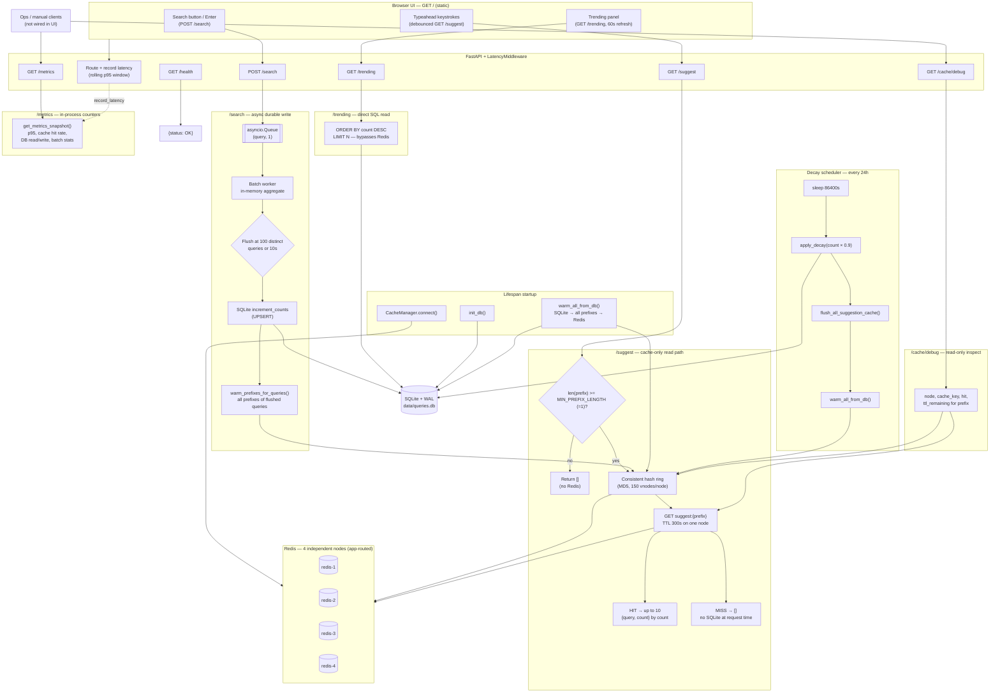

# Typeahead System — Project Report

Distributed autocomplete service built with **FastAPI**, **Redis** (four sharded nodes), and **SQLite**.

---

## 1. Architecture Diagram and Explanation



**Read path (`GET /suggest`)** — Prefix gate: `len(q.lstrip()) < MIN_PREFIX_LENGTH` (1) returns `[]` without Redis. Otherwise consistent hashing routes to one of four independent Redis nodes. Keys are `suggest:{prefix}` (300s TTL). Cache hit returns up to 10 `{query, count}` pairs sorted by count. Cache miss returns `[]`; **no SQLite fallback at request time**.

**Write path (`POST /search`)** — Events enqueue as `(query, 1)` and the API responds immediately. The batch worker aggregates in memory and flushes to SQLite at 100 distinct queries or 10 seconds. After each flush, `warm_prefixes_for_queries()` re-warms every prefix of the flushed queries in Redis.

**Trending (`GET /trending`)** — Reads SQLite directly (`ORDER BY count DESC`); bypasses Redis.

**Observability (`GET /metrics`, `GET /cache/debug`)** — `/metrics` reads in-process counters (rolling p95 from middleware, cache hit/miss from `CacheManager`, DB and batch stats); no per-request DB query. `/cache/debug` inspects hash routing and performs a read-only Redis key lookup for a prefix. Neither endpoint is wired into the static UI.

**Cache warming (SQLite → Redis)** — SQLite is the durable store. Redis is populated at app startup (`warm_all_from_db()`), after each batch flush (`warm_prefixes_for_queries()`), and after the decay cycle (`flush_all_suggestion_cache()` + full re-warm).

**Background tasks** — Batch worker (queue → SQLite → targeted re-warm) and decay scheduler (every 24h: `count × 0.9`, then full cache re-warm). On shutdown, tasks cancel, remaining buffer flushes, and Redis clients close.

---

## 2. Dataset Source and Loading Instructions

This project does **not** import an external live dataset at runtime. Development and Docker startup use **synthetic seed data** from `scripts/load_data.py`.

| Source | Role |
|--------|------|
| `data/queries.csv` | Optional seed file (`query,count` columns). Committed file has header only. |
| Synthetic generator | Default: generates realistic unique queries until minimum row count is met. |

**Defaults:** 200,000 minimum rows (`MIN_QUERY_COUNT`, overridable via `--min-rows` or `SEED_MIN_ROWS`), batch inserts of 5,000, random seed 42.

**Docker (automatic seeding):**

```bash
docker compose up --build
```

If `data/queries.db` is missing, `docker-entrypoint.sh` runs `python scripts/load_data.py`. Database persists in the `app-data` volume.

**Local development:**

```bash
python3 -m venv .venv && source .venv/bin/activate
pip install -r requirements.txt
python scripts/load_data.py
```

Custom CSV: `python scripts/load_data.py --csv path/to/queries.csv --min-rows 200000`. Synthetic rows are appended if the CSV is below `--min-rows`. `data/queries.db` is generated locally and not committed.

---

## 3. API Documentation

Base URL: `http://localhost:8000`

| Endpoint | Method | Purpose | Key input | Response |
|----------|--------|---------|-----------|----------|
| `/` | GET | Static search UI | — | HTML |
| `/health` | GET | Liveness | — | `{"status": "OK"}` |
| `/suggest` | GET | Prefix suggestions (Redis cache only) | `q` (prefix string) | `{"suggestions": [{"query", "count"}, ...]}` — max 10; empty prefix or cache miss → `[]` |
| `/search` | POST | Record search event (async persist) | `{"query": string}` | `{"message": "Searched"}`; empty query → 400 |
| `/trending` | GET | Top global queries from SQLite | `limit` (1–50, default 10) | `{"trending": [{"query", "count"}, ...]}` |
| `/cache/debug` | GET | Inspect cache routing for a prefix | `prefix` | `{"prefix", "node", "cache_key", "hit", "ttl_remaining"}` |
| `/metrics` | GET | In-process counters (p95 latency, cache hit rate, DB ops, batch stats) | — | JSON object |

**`/suggest` behavior:** `len(q.lstrip()) < MIN_PREFIX_LENGTH` (currently 1) → `[]`. Cache hit → Redis data. Cache miss → `[]` (no SQLite).

---

## 4. Design Choices and Tradeoffs

**Trie rejected** — SQLite is the durable store; per-prefix Redis keys sharded via consistent hashing are simpler to distribute than a mutable trie. Batched `UPSERT` plus targeted re-warming avoids trie write amplification. Trade-off: suggest latency depends on cache warmth; cold prefixes return `[]`.

**SQLite + WAL** — Zero-config persistence with concurrent reads during batched writes. Single-node demo; not horizontally scalable for writes.

**Redis + consistent hashing (not Redis Cluster)** — Four independent instances with application-side routing. Stable per-prefix placement and even distribution via virtual nodes. Cost: no automatic failover; a dead node loses its key slice until re-warm.

**Cache-only suggest reads** — Keeps the hot path fast and predictable. Correctness after writes depends on batch re-warming and startup/decay warming.

**`asyncio.Queue` batching** — API responds immediately; 100 events can collapse to one `UPSERT`. Trade-off: counts are eventually consistent; `/trending` may lag up to ~10 seconds behind recent searches.

**Scheduled decay** — Nightly `count × 0.9` then full re-warm, matching a batch "night script" pattern. Trade-off: rankings stay static between cycles.

**In-process metrics** — p95 latency, cache hit rate, and batch reduction via `/metrics` without external APM. Suitable for demos; not production-grade observability.

---

## 5. Performance Report

**No formal benchmark suite or recorded load-test results exist in this repository.** The table below lists design/config targets; wall-clock throughput was not measured for this report.

| Concern | Mechanism | Configured value |
|---------|-----------|------------------|
| Suggest read latency | Redis cache hit (single `GET` per prefix) | TTL 300s |
| Write throughput | Batched aggregation | Flush at 100 queries or 10s |
| Trending freshness | Direct SQLite read | After batch flush |
| Ranking drift | Scheduled decay | Every 24h, factor 0.9 |
| Request observability | Rolling p95 window | Last 1000 HTTP samples |

**How performance is measured:** `/metrics` exposes rolling p95 latency (all routes), cache hit/miss counts, SQLite read/write counters, and batch `write_reduction_ratio` (`search_events / db_writes`). Tests validate behavioral properties (batch aggregation, cache-only suggest with no DB reads on miss, hash distribution uniformity) without reporting throughput numbers.

**Qualitative expectations:** Warm `/suggest` is dominated by Redis round-trip; cold `/suggest` returns `[]` with no SQLite penalty. `POST /search` is near-constant (queue enqueue). `GET /trending` runs `ORDER BY count DESC LIMIT N` against ~200K rows at demo scale. Full startup cache warm from 200K queries can take noticeable time on first boot.

**Known limits:** Single FastAPI process; four Redis nodes without replication; SQLite single-file write ceiling; p95 in `/metrics` includes all HTTP routes, not `/suggest` alone.
